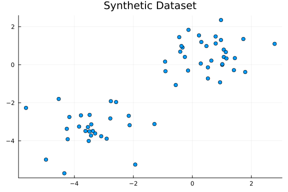
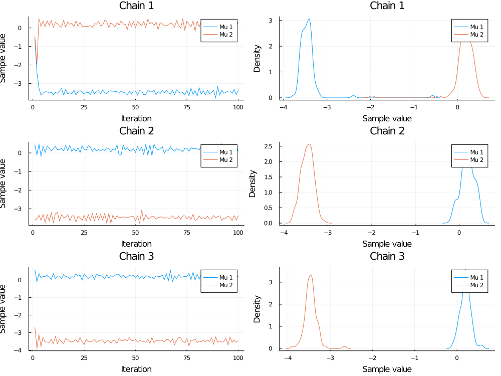
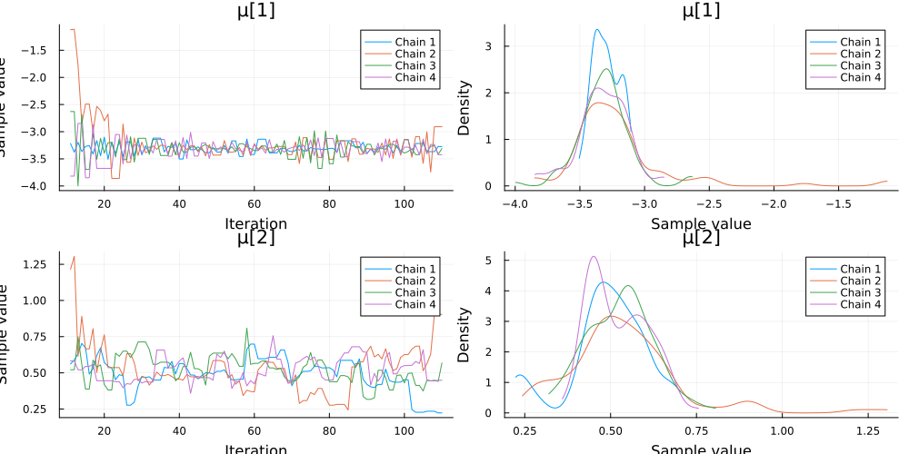
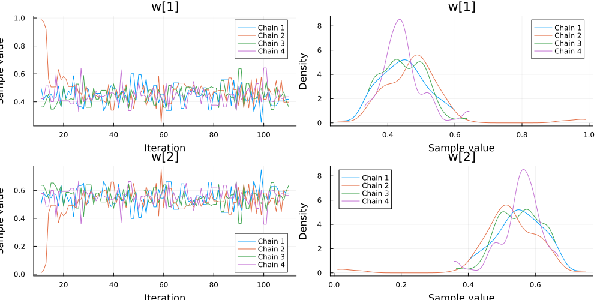
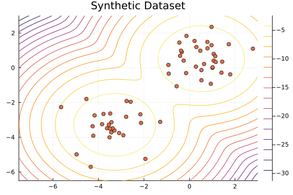
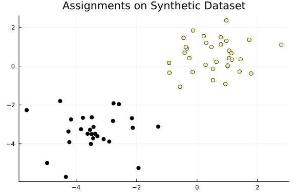
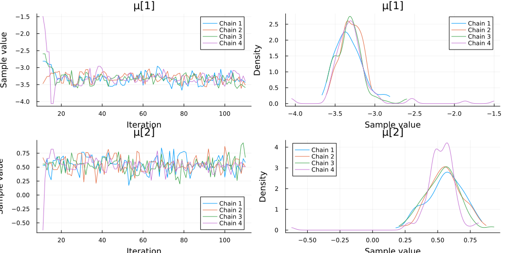
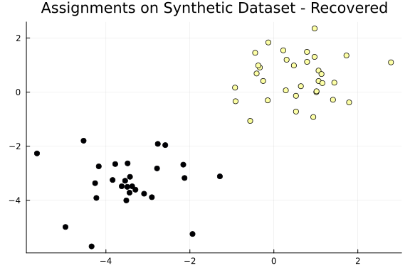

The following tutorial illustrates the use of Turing for clustering data using a Bayesian mixture model.
The aim of this task is to infer a latent grouping (hidden structure) from unlabelled data.

## Synthetic Data

We generate a synthetic dataset of $N = 60$ two-dimensional points $x_i \in \mathbb{R}^2$ drawn from a Gaussian mixture model.
For simplicity, we use $K = 2$ clusters with

  - equal weights, i.e., we use mixture weights $w = [0.5, 0.5]$, and
  - isotropic Gaussian distributions of the points in each cluster.

More concretely, we use the Gaussian distributions $\mathcal{N}([\mu_k, \mu_k]^\mathsf{T}, I)$ with parameters $\mu_1 = -3.5$ and $\mu_2 = 0.5$.

```julia
using Distributions
using FillArrays
using StatsPlots

using LinearAlgebra
using Random

# Set a random seed.
Random.seed!(3)

# Define Gaussian mixture model.
w = [0.5, 0.5]
μ = [-3.5, 0.5]
mixturemodel = MixtureModel([MvNormal(Fill(μₖ, 2), I) for μₖ in μ], w)

# We draw the data points.
N = 60
x = rand(mixturemodel, N);
```


The following plot shows the dataset.

```julia
scatter(x[1, :], x[2, :]; legend=false, title="Synthetic Dataset")
```




## Gaussian Mixture Model in Turing

We are interested in recovering the grouping from the dataset.
More precisely, we want to infer the mixture weights, the parameters $\mu_1$ and $\mu_2$, and the assignment of each datum to a cluster for the generative Gaussian mixture model.

In a Bayesian Gaussian mixture model with $K$ components each data point $x_i$ ($i = 1,\ldots,N$) is generated according to the following generative process.
First we draw the model parameters, i.e., in our example we draw parameters $\mu_k$ for the mean of the isotropic normal distributions and the mixture weights $w$ of the $K$ clusters.
We use standard normal distributions as priors for $\mu_k$ and a Dirichlet distribution with parameters $\alpha_1 = \cdots = \alpha_K = 1$ as prior for $w$:
$$
\begin{aligned}
\mu_k &\sim \mathcal{N}(0, 1) \qquad (k = 1,\ldots,K)\\
w &\sim \operatorname{Dirichlet}(\alpha_1, \ldots, \alpha_K)
\end{aligned}
$$
After having constructed all the necessary model parameters, we can generate an observation by first selecting one of the clusters
$$
z_i \sim \operatorname{Categorical}(w) \qquad (i = 1,\ldots,N),
$$
and then drawing the datum accordingly, i.e., in our example drawing
$$
x_i \sim \mathcal{N}([\mu_{z_i}, \mu_{z_i}]^\mathsf{T}, I) \qquad (i=1,\ldots,N).
$$
For more details on Gaussian mixture models, we refer to Christopher M. Bishop, *Pattern Recognition and Machine Learning*, Section 9.

We specify the model with Turing.

```julia
using Turing

@model function gaussian_mixture_model(x)
    # Draw the parameters for each of the K=2 clusters from a standard normal distribution.
    K = 2
    μ ~ MvNormal(Zeros(K), I)

    # Draw the weights for the K clusters from a Dirichlet distribution with parameters αₖ = 1.
    w ~ Dirichlet(K, 1.0)
    # Alternatively, one could use a fixed set of weights.
    # w = fill(1/K, K)

    # Construct categorical distribution of assignments.
    distribution_assignments = Categorical(w)

    # Construct multivariate normal distributions of each cluster.
    D, N = size(x)
    distribution_clusters = [MvNormal(Fill(μₖ, D), I) for μₖ in μ]

    # Draw assignments for each datum and generate it from the multivariate normal distribution.
    k = Vector{Int}(undef, N)
    for i in 1:N
        k[i] ~ distribution_assignments
        x[:, i] ~ distribution_clusters[k[i]]
    end

    return k
end

model = gaussian_mixture_model(x);
```


We run a MCMC simulation to obtain an approximation of the posterior distribution of the parameters $\mu$ and $w$ and assignments $k$.
We use a `Gibbs` sampler that combines a [particle Gibbs](https://www.stats.ox.ac.uk/%7Edoucet/andrieu_doucet_holenstein_PMCMC.pdf) sampler for the discrete parameters (assignments $k$) and a Hamiltonion Monte Carlo sampler for the continuous parameters ($\mu$ and $w$).
We generate multiple chains in parallel using multi-threading.

```julia
sampler = Gibbs(PG(100, :k), HMC(0.05, 10, :μ, :w))
nsamples = 100
nchains = 4
burn = 10
chains = sample(model, sampler, MCMCThreads(), nsamples, nchains; discard_initial = burn);
```


## Inferred Mixture Model

After sampling we can visualize the trace and density of the parameters of interest.

We consider the samples of the location parameters $\mu_1$ and $\mu_2$ for the two clusters.

```julia
plot(chains[["μ[1]", "μ[2]"]], legend=true)
```




It can happen that the modes of $\mu_1$ and $\mu_2$ switch between chains.
For more information see the [Stan documentation](https://mc-stan.org/users/documentation/case-studies/identifying_mixture_models.html). This is because it's possible for either model parameter $\mu_k$ to be assigned to either of the corresponding true means, and this assignment need not be consistent between chains. 

That is, the posterior is fundamentally multimodal, and different chains can end up in different modes, complicating inference.

One solution here is to enforce an ordering on our $\mu$ vector, requiring $\mu_k > \mu_{k-1}$ for all $k$. 

`Bijectors.jl` [provides](https://turinglang.org/Bijectors.jl/dev/transforms/#Bijectors.OrderedBijector) an easy transformation (`ordered()`) for this purpose:

```julia
using Bijectors: ordered

@model function gaussian_mixture_model_ordered(x)
    # Draw the parameters for each of the K=2 clusters from a standard normal distribution.
    K = 2
    μ ~ ordered(MvNormal(Zeros(K), I))

    # Draw the weights for the K clusters from a Dirichlet distribution with parameters αₖ = 1.
    w ~ Dirichlet(K, 1.0)
    # Alternatively, one could use a fixed set of weights.
    # w = fill(1/K, K)

    # Construct categorical distribution of assignments.
    distribution_assignments = Categorical(w)

    # Construct multivariate normal distributions of each cluster.
    D, N = size(x)
    distribution_clusters = [MvNormal(Fill(μₖ, D), I) for μₖ in μ]

    # Draw assignments for each datum and generate it from the multivariate normal distribution.
    k = Vector{Int}(undef, N)
    for i in 1:N
        k[i] ~ distribution_assignments
        x[:, i] ~ distribution_clusters[k[i]]
    end

    return k
end

model = gaussian_mixture_model_ordered(x);
```


Now, re-running our model, we can see that the assigned means are consistent across chains:

```julia
chains = sample(model, sampler, MCMCThreads(), nsamples, nchains; discard_initial = burn);
```


```julia
plot(chains[["μ[1]", "μ[2]"]]; legend=true)
```




We also inspect the samples of the mixture weights $w$.

```julia
plot(chains[["w[1]", "w[2]"]], legend=true)
```




As the distributions of the samples for the parameters $\mu_1$, $\mu_2$, $w_1$, and $w_2$ are unimodal, we can safely visualize the density region of our model using the average values.

```julia
# Model with mean of samples as parameters.
μ_mean = [mean(chains, "μ[$i]") for i in 1:2]
w_mean = [mean(chains, "w[$i]") for i in 1:2]
mixturemodel_mean = MixtureModel([MvNormal(Fill(μₖ, 2), I) for μₖ in μ_mean], w_mean)

contour(
    range(-7.5, 3; length=1_000),
    range(-6.5, 3; length=1_000),
    (x, y) -> logpdf(mixturemodel_mean, [x, y]);
    widen=false,
)
scatter!(x[1, :], x[2, :]; legend=false, title="Synthetic Dataset")
```




## Inferred Assignments

Finally, we can inspect the assignments of the data points inferred using Turing.
As we can see, the dataset is partitioned into two distinct groups.

```julia
assignments = [mean(chains, "k[$i]") for i in 1:N]
scatter(
    x[1, :],
    x[2, :];
    legend=false,
    title="Assignments on Synthetic Dataset",
    zcolor=assignments,
)
```




## Marginalizing Out The Assignments

We can write out the marginal posterior of (continuous) $w, \mu$ by summing out the influence of our (discrete) assignments $z_i$ from 
our likelihood:

$$
p(y \mid w, \mu ) = \sum_{k=1}^K w_k p_k(y \mid \mu_k)
$$

In our case, this gives us:

$$
p(y \mid w, \mu) = \sum_{k=1}^K w_k \cdot \operatorname{MvNormal}(y \mid \mu_k, I)
$$


### Marginalizing By Hand

We can implement the above version of the Gaussian mixture model in Turing as follows:

First, Turing uses log-probabilities, so the likelihood above must be converted into log-space:

$$
\log \left( p(y \mid w, \mu) \right) = \text{logsumexp} \left[\log (w_k) + \log(\operatorname{MvNormal}(y \mid \mu_k, I)) \right]
$$

Where we sum the components with `logsumexp` from the [`StatsFuns.jl` package](https://github.com/JuliaStats/StatsFuns.jl).


The manually incremented likelihood can be added to the log-probability with `Turing.@addlogprob!`, giving us the following model:

```julia
using StatsFuns

@model function gmm_marginalized(x)
    K = 2
    D, N = size(x)
    μ ~ ordered(MvNormal(Zeros(K), I))
    w ~ Dirichlet(K, 1.0)
    dists = [MvNormal(Fill(μₖ, D), I) for μₖ in μ]

    for i in 1:N
        lvec = Vector(undef, K)
        for k in 1:K
            lvec[k] = (w[k] + logpdf(dists[k], x[:, i]))
        end
        Turing.@addlogprob! logsumexp(lvec)
    end
end

model = gmm_marginalized(x);
```


### Marginalizing For Free With Distribution.jl's MixtureModel Implementation

We can use Turing's `~` syntax with anything that `Distributions.jl` provides `logpdf` and `rand` methods for. It turns out that the
`MixtureModel` distribution it provides has, as it's `logpdf` method, `lpdf(MixtureModel([Component_Distributions], weight_vector), Y)`, where `Y` can be either a single observation or vector of observations.

In fact, `Distributions.jl` provides [many convenient constructors](https://juliastats.org/Distributions.jl/stable/mixture/) for mixture models, allowing further simplification in common special cases (mixtures distributions are of the same type, weight vector is known to allocate probability equally, and so on).

The `logpdf` implementation for a `MixtureModel` distribution is exactly the marginalization defined above, and so our model becomes simply:

```julia
@model function gmm_marginalized(x)
    K = 2
    D, _ = size(x)
    μ ~ ordered(MvNormal(Zeros(K), I))
    w ~ Dirichlet(K, 1.0)

    x ~ MixtureModel([MvNormal(Fill(μₖ, D), I) for μₖ in μ], w)
end

model = gmm_marginalized(x);
```


As we've summed out the discrete components, we can perform inference using `NUTS()` alone. 

```julia
sampler = NUTS()
chains = sample(model, sampler, MCMCThreads(), nsamples, nchains; discard_initial = burn);
```


`NUTS()` significantly outperforms our compositional Gibbs sampler, in large part because our model is now Rao-Blackwellized thanks to 
the marginalization of our assignment parameter.


```julia
plot(chains[["μ[1]", "μ[2]"]], legend=true)
```




## Inferred Assignments - Marginalized Model

As we've summed over possible assignments, the associated parameter is no longer available in our chain. 
This is not a problem, however, as given any fixed sample $(\mu, w)$, the assignment probability — $p(z_i \mid y_i)$ — can be recovered using Bayes rule:

$$
p(z_i \mid y_i) = \frac{p(y_i \mid z_i) p(z_i)}{\sum_{k = 1}^K \left(p(y_i \mid z_i) p(z_i) \right)}
$$

This quantity can be computed for every $p(z = z_i \mid y_i)$, resulting in a probability vector, which is then used to sample 
posterior predictive assignments from a categorial distribution.

For details on the mathematics here, see [the Stan documentation on latent discrete parameters](https://mc-stan.org/docs/stan-users-guide/latent-discrete.html).

```julia
@model function gmm_recover(x)
    K = 2
    D, N =  size(x)
    μ ~ ordered(MvNormal(Zeros(K), I))
    w ~ Dirichlet(K, 1.0)

    dists = [MvNormal(Fill(μₖ, D), I) for μₖ in μ]

    x ~ MixtureModel(dists, w)

    # Return sample_class(yi) for fixed μ, w.
    function sample_class(xi)
        lvec = [(logpdf(d, xi) + log(w[i])) for (i, d) in enumerate(dists)]
        rand(Categorical(exp.(lvec .- logsumexp(lvec))))
    end

    # Return assignment draws for each datapoint.
    return [sample_class(x[:, i]) for i in 1:N]
end
```

```
gmm_recover (generic function with 2 methods)
```


We sample from this model as before:

```julia
chains = sample(model, sampler, MCMCThreads(), nsamples, nchains; discard_initial = burn);
```


Given a sample from the marginalized posterior, these assignments can be recovered with:

```julia
assignments = mean(generated_quantities(gmm_recover(x), chains))
```

```
60-element Vector{Float64}:
 1.0
 2.0
 1.0
 2.0
 2.0
 1.0
 2.0
 2.0
 1.0025
 1.0
 ⋮
 1.0
 2.0
 1.0
 1.0
 1.9975
 2.0
 1.0
 1.0
 2.0
```


```julia
scatter(
    x[1, :],
    x[2, :];
    legend=false,
    title="Assignments on Synthetic Dataset - Recovered",
    zcolor=assignments,
)
```




## Appendix

These tutorials are a part of the TuringTutorials repository, found at: [https://github.com/TuringLang/TuringTutorials](https://github.com/TuringLang/TuringTutorials).

To locally run this tutorial, do the following commands:

```
using TuringTutorials
TuringTutorials.weave("01-gaussian-mixture-model", "01_gaussian-mixture-model.jmd")
```

Computer Information:

```
Julia Version 1.10.2
Commit bd47eca2c8a (2024-03-01 10:14 UTC)
Build Info:
  Official https://julialang.org/ release
Platform Info:
  OS: macOS (arm64-apple-darwin22.4.0)
  CPU: 8 × Apple M1
  WORD_SIZE: 64
  LIBM: libopenlibm
  LLVM: libLLVM-15.0.7 (ORCJIT, apple-m1)
Threads: 6 default, 0 interactive, 3 GC (on 4 virtual cores)
Environment:
  JULIA_EDITOR = code
  JULIA_NUM_THREADS = 6
  DYLD_FALLBACK_LIBRARY_PATH = /Users/pekos/.julia/artifacts/5902919ba30b97bafa388ca950a351ea32516d26/lib:/Users/pekos/.julia/artifacts/92b949e2f3a66439c69a8d334fc95810fbd9df9b/lib:/Users/pekos/.julia/artifacts/5b338c8fa90c05e6faea86e54d2996cca76cfbbe/lib:/Users/pekos/.julia/juliaup/julia-1.10.2+0.aarch64.apple.darwin14/lib/julia:/Users/pekos/.julia/artifacts/0b234a64c0574e6156c740b15844963c0555164e/lib:/Users/pekos/.julia/artifacts/9410bad2635eda2239b4a72ba4316c4aa8f5b76e/lib:/Users/pekos/.julia/artifacts/a7cf2895cac9b6bec2c94e6490ca337e00b12894/lib:/Users/pekos/.julia/artifacts/10b2b258c07d7a76b2e3331f1ed70d8a8eb6d71c/lib:/Users/pekos/.julia/artifacts/9a76a401f82e0e3cafce618fb8d2d5c307ab2836/lib:/Users/pekos/.julia/artifacts/e8b17d4e8df51de281bf55f890ba48f924e41ce3/lib:/Users/pekos/.julia/artifacts/c65e07e3da4f1bf519bc432389dbbd61df320457/lib:/Users/pekos/.julia/artifacts/4ec62d729213a748d2300dd0832ebe8ed2292093/lib:/Users/pekos/.julia/artifacts/e6b9fb44029423f5cd69e0cbbff25abcc4b32a8f/lib:/Users/pekos/.julia/artifacts/fb8b9a86c16889fbeb669622623a954bb773fce8/lib:/Users/pekos/.julia/artifacts/df3881e810714d6a09467fe85a6fde79385fe702/lib:/Users/pekos/.julia/artifacts/3b3d0bcaf14a9b239a4f4dc20ef7b9e63030a47e/lib:/Users/pekos/.julia/artifacts/abf161ac3d4df76ae74bbf5432b7e061b3876236/lib:/Users/pekos/.julia/artifacts/4260cf51a368d8e305a5de3669e32539e1e6cc72/lib:/Users/pekos/.julia/artifacts/fc7ba632b72ce7d852c1924aa2bbfe244a71c780/lib:/Users/pekos/.julia/artifacts/413111420faa4e2aeaa383c075eaa213402d939c/lib:/Users/pekos/.julia/artifacts/ca2831bf6edc5088aec5b329ea98364951d6cad0/lib:/Users/pekos/.julia/artifacts/3fe6bf926e57cc4be598151cd40832221de2e894/lib:/Users/pekos/.julia/artifacts/c325a23bc1f6521474cef5f634f18c8ab311bb02/lib:/Users/pekos/.julia/artifacts/0db9c3f6cf936a0da49e2ba954ba3e10bed6ad72/lib:/Users/pekos/.julia/artifacts/1a7e22e66b523d9cb884cf85c3ec065b5fb3e5c3/lib:/Users/pekos/.julia/artifacts/91d16d8e67cf04eb9240c5d28f057b567e2b8dab/lib:/Users/pekos/.julia/artifacts/4609432e7098d8434a7a4c7876dd5b9e09b2a5e7/lib:/Users/pekos/.julia/artifacts/6095fcd268ea712c0f786f5ff1a45bf0eb7b005e/lib:/Users/pekos/.julia/artifacts/8dfccc7f1aa9d156f12a6e7db599014b805b11f2/lib:/Users/pekos/.julia/artifacts/13ab26d7214d6ea78e7839477d2262c18b38b450/lib:/Users/pekos/.julia/artifacts/b450526929615030746974fd622effa333c2c87a/lib:/Users/pekos/.julia/artifacts/fb653fdc268e50c0be4391f6ca2f2fce2be7f15b/lib:/Users/pekos/.julia/artifacts/3908ba61f3e144a7e7e28b9d676ca770f2f6a955/lib:/Users/pekos/.julia/artifacts/2107e7bc404f11b178cb9724cb371ef704995727/lib:/Users/pekos/.julia/artifacts/4b3b2d79556cc3aef6e3d8a234649cc85b91bb87/lib:/Users/pekos/.julia/artifacts/dc1fe71ef939802ae7490350407bea0f47e5be5f/lib/QtConcurrent.framework/Versions/A:/Users/pekos/.julia/artifacts/dc1fe71ef939802ae7490350407bea0f47e5be5f/lib/QtCore.framework/Versions/A:/Users/pekos/.julia/artifacts/dc1fe71ef939802ae7490350407bea0f47e5be5f/lib/QtDBus.framework/Versions/A:/Users/pekos/.julia/artifacts/dc1fe71ef939802ae7490350407bea0f47e5be5f/lib/QtGui.framework/Versions/A:/Users/pekos/.julia/artifacts/dc1fe71ef939802ae7490350407bea0f47e5be5f/lib/QtNetwork.framework/Versions/A:/Users/pekos/.julia/artifacts/dc1fe71ef939802ae7490350407bea0f47e5be5f/lib/QtOpenGL.framework/Versions/A:/Users/pekos/.julia/artifacts/dc1fe71ef939802ae7490350407bea0f47e5be5f/lib/QtPrintSupport.framework/Versions/A:/Users/pekos/.julia/artifacts/dc1fe71ef939802ae7490350407bea0f47e5be5f/lib/QtSql.framework/Versions/A:/Users/pekos/.julia/artifacts/dc1fe71ef939802ae7490350407bea0f47e5be5f/lib/QtTest.framework/Versions/A:/Users/pekos/.julia/artifacts/dc1fe71ef939802ae7490350407bea0f47e5be5f/lib/QtWidgets.framework/Versions/A:/Users/pekos/.julia/artifacts/dc1fe71ef939802ae7490350407bea0f47e5be5f/lib/QtXml.framework/Versions/A:/Users/pekos/.julia/artifacts/2711a7295dd2796d38718436686a5cdfe32d1d1c/lib:/Users/pekos/.julia/juliaup/julia-1.10.2+0.aarch64.apple.darwin14/bin/../lib/julia:/Users/pekos/.julia/juliaup/julia-1.10.2+0.aarch64.apple.darwin14/bin/../lib:

```

Package Information:

```
Status `~/Documents/TuringTutorials/tutorials/01-gaussian-mixture-model/Project.toml`
  [76274a88] Bijectors v0.13.8
⌃ [31c24e10] Distributions v0.25.102
⌃ [1a297f60] FillArrays v1.6.1
  [4c63d2b9] StatsFuns v1.3.1
⌃ [f3b207a7] StatsPlots v0.15.6
⌃ [fce5fe82] Turing v0.29.2
  [37e2e46d] LinearAlgebra
  [9a3f8284] Random
Info Packages marked with ⌃ have new versions available and may be upgradable.
```

And the full manifest:

```
Status `~/Documents/TuringTutorials/tutorials/01-gaussian-mixture-model/Manifest.toml`
  [47edcb42] ADTypes v0.2.7
  [621f4979] AbstractFFTs v1.5.0
⌅ [80f14c24] AbstractMCMC v4.4.2
⌅ [7a57a42e] AbstractPPL v0.6.2
  [1520ce14] AbstractTrees v0.4.5
  [7d9f7c33] Accessors v0.1.36
  [79e6a3ab] Adapt v4.0.4
⌅ [0bf59076] AdvancedHMC v0.5.5
⌅ [5b7e9947] AdvancedMH v0.7.5
⌅ [576499cb] AdvancedPS v0.4.3
  [b5ca4192] AdvancedVI v0.2.4
  [dce04be8] ArgCheck v2.3.0
  [7d9fca2a] Arpack v0.5.4
  [4fba245c] ArrayInterface v7.9.0
  [a9b6321e] Atomix v0.1.0
⌃ [13072b0f] AxisAlgorithms v1.0.1
  [39de3d68] AxisArrays v0.4.7
⌅ [198e06fe] BangBang v0.3.40
  [9718e550] Baselet v0.1.1
  [76274a88] Bijectors v0.13.8
  [d1d4a3ce] BitFlags v0.1.8
  [fa961155] CEnum v0.5.0
  [49dc2e85] Calculus v0.5.1
  [082447d4] ChainRules v1.63.0
  [d360d2e6] ChainRulesCore v1.23.0
  [9e997f8a] ChangesOfVariables v0.1.8
  [aaaa29a8] Clustering v0.15.7
  [944b1d66] CodecZlib v0.7.4
  [35d6a980] ColorSchemes v3.24.0
  [3da002f7] ColorTypes v0.11.5
  [c3611d14] ColorVectorSpace v0.10.0
  [5ae59095] Colors v0.12.10
  [861a8166] Combinatorics v1.0.2
  [38540f10] CommonSolve v0.2.4
  [bbf7d656] CommonSubexpressions v0.3.0
  [34da2185] Compat v4.14.0
  [a33af91c] CompositionsBase v0.1.2
  [f0e56b4a] ConcurrentUtilities v2.4.1
  [88cd18e8] ConsoleProgressMonitor v0.1.2
  [187b0558] ConstructionBase v1.5.5
  [d38c429a] Contour v0.6.3
  [a8cc5b0e] Crayons v4.1.1
  [9a962f9c] DataAPI v1.16.0
  [864edb3b] DataStructures v0.18.18
  [e2d170a0] DataValueInterfaces v1.0.0
  [244e2a9f] DefineSingletons v0.1.2
  [8bb1440f] DelimitedFiles v1.9.1
  [b429d917] DensityInterface v0.4.0
  [163ba53b] DiffResults v1.1.0
  [b552c78f] DiffRules v1.15.1
  [b4f34e82] Distances v0.10.11
⌃ [31c24e10] Distributions v0.25.102
  [ced4e74d] DistributionsAD v0.6.54
  [ffbed154] DocStringExtensions v0.9.3
  [fa6b7ba4] DualNumbers v0.6.8
⌅ [366bfd00] DynamicPPL v0.23.21
⌅ [cad2338a] EllipticalSliceSampling v1.1.0
  [4e289a0a] EnumX v1.0.4
  [460bff9d] ExceptionUnwrapping v0.1.10
  [e2ba6199] ExprTools v0.1.10
  [c87230d0] FFMPEG v0.4.1
  [7a1cc6ca] FFTW v1.8.0
⌃ [1a297f60] FillArrays v1.6.1
  [53c48c17] FixedPointNumbers v0.8.4
  [1fa38f19] Format v1.3.7
  [f6369f11] ForwardDiff v0.10.36
  [069b7b12] FunctionWrappers v1.1.3
  [77dc65aa] FunctionWrappersWrappers v0.1.3
  [d9f16b24] Functors v0.4.10
  [46192b85] GPUArraysCore v0.1.6
  [28b8d3ca] GR v0.73.3
  [42e2da0e] Grisu v1.0.2
  [cd3eb016] HTTP v1.10.5
  [34004b35] HypergeometricFunctions v0.3.23
  [22cec73e] InitialValues v0.3.1
  [505f98c9] InplaceOps v0.3.0
⌅ [a98d9a8b] Interpolations v0.14.0
  [8197267c] IntervalSets v0.7.10
  [3587e190] InverseFunctions v0.1.13
  [41ab1584] InvertedIndices v1.3.0
  [92d709cd] IrrationalConstants v0.2.2
  [c8e1da08] IterTools v1.10.0
  [82899510] IteratorInterfaceExtensions v1.0.0
  [1019f520] JLFzf v0.1.7
  [692b3bcd] JLLWrappers v1.5.0
  [682c06a0] JSON v0.21.4
  [63c18a36] KernelAbstractions v0.9.18
  [5ab0869b] KernelDensity v0.6.8
  [929cbde3] LLVM v6.6.3
  [8ac3fa9e] LRUCache v1.6.1
  [b964fa9f] LaTeXStrings v1.3.1
  [23fbe1c1] Latexify v0.16.2
  [1d6d02ad] LeftChildRightSiblingTrees v0.2.0
  [6f1fad26] Libtask v0.8.7
  [6fdf6af0] LogDensityProblems v2.1.1
  [996a588d] LogDensityProblemsAD v1.7.0
  [2ab3a3ac] LogExpFunctions v0.3.27
  [e6f89c97] LoggingExtras v1.0.3
  [c7f686f2] MCMCChains v6.0.6
  [be115224] MCMCDiagnosticTools v0.3.10
  [e80e1ace] MLJModelInterface v1.9.6
  [1914dd2f] MacroTools v0.5.13
  [dbb5928d] MappedArrays v0.4.2
  [739be429] MbedTLS v1.1.9
  [442fdcdd] Measures v0.3.2
⌅ [128add7d] MicroCollections v0.1.4
  [e1d29d7a] Missings v1.2.0
  [6f286f6a] MultivariateStats v0.10.2
  [872c559c] NNlib v0.9.13
  [77ba4419] NaNMath v1.0.2
  [86f7a689] NamedArrays v0.10.1
  [c020b1a1] NaturalSort v1.0.0
  [b8a86587] NearestNeighbors v0.4.16
  [510215fc] Observables v0.5.5
  [6fe1bfb0] OffsetArrays v1.13.0
  [4d8831e6] OpenSSL v1.4.2
  [3bd65402] Optimisers v0.3.3
  [bac558e1] OrderedCollections v1.6.3
  [90014a1f] PDMats v0.11.31
  [69de0a69] Parsers v2.8.1
  [b98c9c47] Pipe v1.3.0
  [ccf2f8ad] PlotThemes v3.1.0
  [995b91a9] PlotUtils v1.4.1
  [91a5bcdd] Plots v1.40.3
  [aea7be01] PrecompileTools v1.2.1
  [21216c6a] Preferences v1.4.3
  [08abe8d2] PrettyTables v2.3.1
  [33c8b6b6] ProgressLogging v0.1.4
  [92933f4c] ProgressMeter v1.10.0
  [1fd47b50] QuadGK v2.9.4
  [74087812] Random123 v1.7.0
  [e6cf234a] RandomNumbers v1.5.3
  [b3c3ace0] RangeArrays v0.3.2
  [c84ed2f1] Ratios v0.4.5
  [c1ae055f] RealDot v0.1.0
  [3cdcf5f2] RecipesBase v1.3.4
  [01d81517] RecipesPipeline v0.6.12
  [731186ca] RecursiveArrayTools v3.13.0
  [189a3867] Reexport v1.2.2
  [05181044] RelocatableFolders v1.0.1
  [ae029012] Requires v1.3.0
  [79098fc4] Rmath v0.7.1
  [f2b01f46] Roots v2.1.5
  [7e49a35a] RuntimeGeneratedFunctions v0.5.12
  [0bca4576] SciMLBase v2.31.0
  [c0aeaf25] SciMLOperators v0.3.8
  [53ae85a6] SciMLStructures v1.1.0
  [30f210dd] ScientificTypesBase v3.0.0
  [6c6a2e73] Scratch v1.2.1
  [91c51154] SentinelArrays v1.4.1
  [efcf1570] Setfield v1.1.1
  [992d4aef] Showoff v1.0.3
  [777ac1f9] SimpleBufferStream v1.1.0
  [ce78b400] SimpleUnPack v1.1.0
  [a2af1166] SortingAlgorithms v1.2.1
  [dc90abb0] SparseInverseSubset v0.1.2
  [276daf66] SpecialFunctions v2.3.1
  [171d559e] SplittablesBase v0.1.15
  [90137ffa] StaticArrays v1.9.3
  [1e83bf80] StaticArraysCore v1.4.2
  [64bff920] StatisticalTraits v3.2.0
  [82ae8749] StatsAPI v1.7.0
  [2913bbd2] StatsBase v0.34.3
  [4c63d2b9] StatsFuns v1.3.1
⌃ [f3b207a7] StatsPlots v0.15.6
  [892a3eda] StringManipulation v0.3.4
  [09ab397b] StructArrays v0.6.18
  [2efcf032] SymbolicIndexingInterface v0.3.15
  [ab02a1b2] TableOperations v1.2.0
  [3783bdb8] TableTraits v1.0.1
  [bd369af6] Tables v1.11.1
  [62fd8b95] TensorCore v0.1.1
  [5d786b92] TerminalLoggers v0.1.7
  [9f7883ad] Tracker v0.2.33
  [3bb67fe8] TranscodingStreams v0.10.7
⌃ [28d57a85] Transducers v0.4.80
⌃ [fce5fe82] Turing v0.29.2
  [5c2747f8] URIs v1.5.1
  [1cfade01] UnicodeFun v0.4.1
  [1986cc42] Unitful v1.19.0
  [45397f5d] UnitfulLatexify v1.6.3
  [013be700] UnsafeAtomics v0.2.1
  [d80eeb9a] UnsafeAtomicsLLVM v0.1.3
  [41fe7b60] Unzip v0.2.0
  [cc8bc4a8] Widgets v0.6.6
⌅ [efce3f68] WoodburyMatrices v0.5.6
  [700de1a5] ZygoteRules v0.2.5
⌅ [68821587] Arpack_jll v3.5.1+1
  [6e34b625] Bzip2_jll v1.0.8+1
  [83423d85] Cairo_jll v1.18.0+1
  [2702e6a9] EpollShim_jll v0.0.20230411+0
  [2e619515] Expat_jll v2.5.0+0
⌅ [b22a6f82] FFMPEG_jll v4.4.4+1
  [f5851436] FFTW_jll v3.3.10+0
  [a3f928ae] Fontconfig_jll v2.13.93+0
  [d7e528f0] FreeType2_jll v2.13.1+0
  [559328eb] FriBidi_jll v1.0.10+0
  [0656b61e] GLFW_jll v3.3.9+0
  [d2c73de3] GR_jll v0.73.3+0
  [78b55507] Gettext_jll v0.21.0+0
  [7746bdde] Glib_jll v2.80.0+0
  [3b182d85] Graphite2_jll v1.3.14+0
  [2e76f6c2] HarfBuzz_jll v2.8.1+1
  [1d5cc7b8] IntelOpenMP_jll v2024.0.2+0
  [aacddb02] JpegTurbo_jll v3.0.2+0
  [c1c5ebd0] LAME_jll v3.100.1+0
  [88015f11] LERC_jll v3.0.0+1
  [dad2f222] LLVMExtra_jll v0.0.29+0
  [1d63c593] LLVMOpenMP_jll v15.0.7+0
  [dd4b983a] LZO_jll v2.10.1+0
⌅ [e9f186c6] Libffi_jll v3.2.2+1
  [d4300ac3] Libgcrypt_jll v1.8.7+0
  [7e76a0d4] Libglvnd_jll v1.6.0+0
  [7add5ba3] Libgpg_error_jll v1.42.0+0
  [94ce4f54] Libiconv_jll v1.17.0+0
  [4b2f31a3] Libmount_jll v2.39.3+0
⌅ [89763e89] Libtiff_jll v4.5.1+1
  [38a345b3] Libuuid_jll v2.39.3+1
  [856f044c] MKL_jll v2024.0.0+0
  [e7412a2a] Ogg_jll v1.3.5+1
  [458c3c95] OpenSSL_jll v3.0.13+1
  [efe28fd5] OpenSpecFun_jll v0.5.5+0
  [91d4177d] Opus_jll v1.3.2+0
  [30392449] Pixman_jll v0.42.2+0
  [c0090381] Qt6Base_jll v6.5.3+1
  [f50d1b31] Rmath_jll v0.4.0+0
  [a44049a8] Vulkan_Loader_jll v1.3.243+0
  [a2964d1f] Wayland_jll v1.21.0+1
  [2381bf8a] Wayland_protocols_jll v1.31.0+0
  [02c8fc9c] XML2_jll v2.12.6+0
  [aed1982a] XSLT_jll v1.1.34+0
  [ffd25f8a] XZ_jll v5.4.6+0
  [f67eecfb] Xorg_libICE_jll v1.0.10+1
  [c834827a] Xorg_libSM_jll v1.2.3+0
  [4f6342f7] Xorg_libX11_jll v1.8.6+0
  [0c0b7dd1] Xorg_libXau_jll v1.0.11+0
  [935fb764] Xorg_libXcursor_jll v1.2.0+4
  [a3789734] Xorg_libXdmcp_jll v1.1.4+0
  [1082639a] Xorg_libXext_jll v1.3.4+4
  [d091e8ba] Xorg_libXfixes_jll v5.0.3+4
  [a51aa0fd] Xorg_libXi_jll v1.7.10+4
  [d1454406] Xorg_libXinerama_jll v1.1.4+4
  [ec84b674] Xorg_libXrandr_jll v1.5.2+4
  [ea2f1a96] Xorg_libXrender_jll v0.9.10+4
  [14d82f49] Xorg_libpthread_stubs_jll v0.1.1+0
  [c7cfdc94] Xorg_libxcb_jll v1.15.0+0
  [cc61e674] Xorg_libxkbfile_jll v1.1.2+0
  [e920d4aa] Xorg_xcb_util_cursor_jll v0.1.4+0
  [12413925] Xorg_xcb_util_image_jll v0.4.0+1
  [2def613f] Xorg_xcb_util_jll v0.4.0+1
  [975044d2] Xorg_xcb_util_keysyms_jll v0.4.0+1
  [0d47668e] Xorg_xcb_util_renderutil_jll v0.3.9+1
  [c22f9ab0] Xorg_xcb_util_wm_jll v0.4.1+1
  [35661453] Xorg_xkbcomp_jll v1.4.6+0
  [33bec58e] Xorg_xkeyboard_config_jll v2.39.0+0
  [c5fb5394] Xorg_xtrans_jll v1.5.0+0
  [3161d3a3] Zstd_jll v1.5.6+0
  [35ca27e7] eudev_jll v3.2.9+0
⌅ [214eeab7] fzf_jll v0.43.0+0
  [1a1c6b14] gperf_jll v3.1.1+0
  [a4ae2306] libaom_jll v3.4.0+0
  [0ac62f75] libass_jll v0.15.1+0
  [2db6ffa8] libevdev_jll v1.11.0+0
  [f638f0a6] libfdk_aac_jll v2.0.2+0
  [36db933b] libinput_jll v1.18.0+0
  [b53b4c65] libpng_jll v1.6.43+1
  [f27f6e37] libvorbis_jll v1.3.7+1
  [009596ad] mtdev_jll v1.1.6+0
  [1270edf5] x264_jll v2021.5.5+0
  [dfaa095f] x265_jll v3.5.0+0
  [d8fb68d0] xkbcommon_jll v1.4.1+1
  [0dad84c5] ArgTools v1.1.1
  [56f22d72] Artifacts
  [2a0f44e3] Base64
  [ade2ca70] Dates
  [8ba89e20] Distributed
  [f43a241f] Downloads v1.6.0
  [7b1f6079] FileWatching
  [9fa8497b] Future
  [b77e0a4c] InteractiveUtils
  [4af54fe1] LazyArtifacts
  [b27032c2] LibCURL v0.6.4
  [76f85450] LibGit2
  [8f399da3] Libdl
  [37e2e46d] LinearAlgebra
  [56ddb016] Logging
  [d6f4376e] Markdown
  [a63ad114] Mmap
  [ca575930] NetworkOptions v1.2.0
  [44cfe95a] Pkg v1.10.0
  [de0858da] Printf
  [3fa0cd96] REPL
  [9a3f8284] Random
  [ea8e919c] SHA v0.7.0
  [9e88b42a] Serialization
  [1a1011a3] SharedArrays
  [6462fe0b] Sockets
  [2f01184e] SparseArrays v1.10.0
  [10745b16] Statistics v1.10.0
  [4607b0f0] SuiteSparse
  [fa267f1f] TOML v1.0.3
  [a4e569a6] Tar v1.10.0
  [8dfed614] Test
  [cf7118a7] UUIDs
  [4ec0a83e] Unicode
  [e66e0078] CompilerSupportLibraries_jll v1.1.0+0
  [deac9b47] LibCURL_jll v8.4.0+0
  [e37daf67] LibGit2_jll v1.6.4+0
  [29816b5a] LibSSH2_jll v1.11.0+1
  [c8ffd9c3] MbedTLS_jll v2.28.2+1
  [14a3606d] MozillaCACerts_jll v2023.1.10
  [4536629a] OpenBLAS_jll v0.3.23+4
  [05823500] OpenLibm_jll v0.8.1+2
  [efcefdf7] PCRE2_jll v10.42.0+1
  [bea87d4a] SuiteSparse_jll v7.2.1+1
  [83775a58] Zlib_jll v1.2.13+1
  [8e850b90] libblastrampoline_jll v5.8.0+1
  [8e850ede] nghttp2_jll v1.52.0+1
  [3f19e933] p7zip_jll v17.4.0+2
Info Packages marked with ⌃ and ⌅ have new versions available. Those with ⌃ may be upgradable, but those with ⌅ are restricted by compatibility constraints from upgrading. To see why use `status --outdated -m`
```

