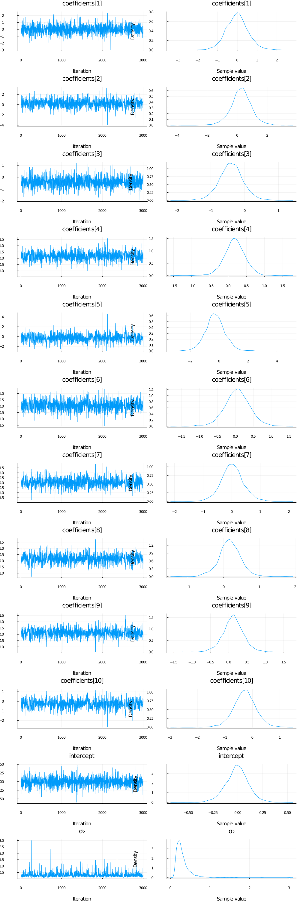

Turing is powerful when applied to complex hierarchical models, but it can also be put to task at common statistical procedures, like [linear regression](https://en.wikipedia.org/wiki/Linear_regression). This tutorial covers how to implement a linear regression model in Turing.

## Set Up

We begin by importing all the necessary libraries.


```julia
# Import Turing and Distributions.
using Turing, Distributions

# Import RDatasets.
using RDatasets

# Import MCMCChains, Plots, and StatPlots for visualizations and diagnostics.
using MCMCChains, Plots, StatsPlots

# Functionality for splitting and normalizing the data.
using MLDataUtils: shuffleobs, splitobs, rescale!

# Functionality for evaluating the model predictions.
using Distances

# Set a seed for reproducibility.
using Random
Random.seed!(0)

# Hide the progress prompt while sampling.
Turing.setprogress!(false);
```


We will use the `mtcars` dataset from the [RDatasets](https://github.com/johnmyleswhite/RDatasets.jl) package. `mtcars` contains a variety of statistics on different car models, including their miles per gallon, number of cylinders, and horsepower, among others.

We want to know if we can construct a Bayesian linear regression model to predict the miles per gallon of a car, given the other statistics it has. Lets take a look at the data we have.


```julia
# Import the "Default" dataset.
data = RDatasets.dataset("datasets", "mtcars");

# Show the first six rows of the dataset.
first(data, 6)
```

```
6×12 DataFrame
 Row │ Model              MPG      Cyl    Disp     HP     DRat     WT      
 QS ⋯
     │ String             Float64  Int64  Float64  Int64  Float64  Float64 
 Fl ⋯
─────┼─────────────────────────────────────────────────────────────────────
─────
   1 │ Mazda RX4             21.0      6    160.0    110     3.9     2.62  
    ⋯
   2 │ Mazda RX4 Wag         21.0      6    160.0    110     3.9     2.875
   3 │ Datsun 710            22.8      4    108.0     93     3.85    2.32
   4 │ Hornet 4 Drive        21.4      6    258.0    110     3.08    3.215
   5 │ Hornet Sportabout     18.7      8    360.0    175     3.15    3.44  
    ⋯
   6 │ Valiant               18.1      6    225.0    105     2.76    3.46
                                                               5 columns om
itted
```


```julia
size(data)
```

```
(32, 12)
```


The next step is to get our data ready for testing. We'll split the `mtcars` dataset into two subsets, one for training our model and one for evaluating our model. Then, we separate the targets we want to learn (`MPG`, in this case) and standardize the datasets by subtracting each column's means and dividing by the standard deviation of that column. The resulting data is not very familiar looking, but this standardization process helps the sampler converge far easier.


```julia
# Remove the model column.
select!(data, Not(:Model))

# Split our dataset 70%/30% into training/test sets.
trainset, testset = splitobs(shuffleobs(data), 0.7)

# Turing requires data in matrix form.
target = :MPG
train = Matrix(select(trainset, Not(target)))
test = Matrix(select(testset, Not(target)))
train_target = trainset[:, target]
test_target = testset[:, target]

# Standardize the features.
μ, σ = rescale!(train; obsdim = 1)
rescale!(test, μ, σ; obsdim = 1)

# Standardize the targets.
μtarget, σtarget = rescale!(train_target; obsdim = 1)
rescale!(test_target, μtarget, σtarget; obsdim = 1);
```


## Model Specification

In a traditional frequentist model using [OLS](https://en.wikipedia.org/wiki/Ordinary_least_squares), our model might look like:

$$
\mathrm{MPG}_i = \alpha + \boldsymbol{\beta}^\mathsf{T}\boldsymbol{X_i}
$$

where $\boldsymbol{\beta}$ is a vector of coefficients and $\boldsymbol{X}$ is a vector of inputs for observation $i$. The Bayesian model we are more concerned with is the following:

$$
\mathrm{MPG}_i \sim \mathcal{N}(\alpha + \boldsymbol{\beta}^\mathsf{T}\boldsymbol{X_i}, \sigma^2)
$$

where $\alpha$ is an intercept term common to all observations, $\boldsymbol{\beta}$ is a coefficient vector, $\boldsymbol{X_i}$ is the observed data for car $i$, and $\sigma^2$ is a common variance term.

For $\sigma^2$, we assign a prior of `truncated(Normal(0, 100), 0, Inf)`. This is consistent with [Andrew Gelman's recommendations](http://www.stat.columbia.edu/~gelman/research/published/taumain.pdf) on noninformative priors for variance. The intercept term ($\alpha$) is assumed to be normally distributed with a mean of zero and a variance of three. This represents our assumptions that miles per gallon can be explained mostly by our assorted variables, but a high variance term indicates our uncertainty about that. Each coefficient is assumed to be normally distributed with a mean of zero and a variance of 10. We do not know that our coefficients are different from zero, and we don't know which ones are likely to be the most important, so the variance term is quite high. Lastly, each observation $y_i$ is distributed according to the calculated `mu` term given by $\alpha + \boldsymbol{\beta}^\mathsf{T}\boldsymbol{X_i}$.


```julia
# Bayesian linear regression.
@model function linear_regression(x, y)
    # Set variance prior.
    σ₂ ~ truncated(Normal(0, 100), 0, Inf)
    
    # Set intercept prior.
    intercept ~ Normal(0, sqrt(3))
    
    # Set the priors on our coefficients.
    nfeatures = size(x, 2)
    coefficients ~ MvNormal(nfeatures, sqrt(10))
    
    # Calculate all the mu terms.
    mu = intercept .+ x * coefficients
    y ~ MvNormal(mu, sqrt(σ₂))
end
```

```
linear_regression (generic function with 1 method)
```


With our model specified, we can call the sampler. We will use the No U-Turn Sampler ([NUTS](http://turing.ml/docs/library/#-turingnuts--type)) here. 

```julia
model = linear_regression(train, train_target)
chain = sample(model, NUTS(0.65), 3_000);
```


As a visual check to confirm that our coefficients have converged, we show the densities and trace plots for our parameters using the `plot` functionality.


```julia
plot(chain)
```




It looks like each of our parameters has converged. We can check our numerical esimates using `describe(chain)`, as below.

```julia
describe(chain)
```

```
2-element Vector{MCMCChains.ChainDataFrame}:
 Summary Statistics (12 x 7)
 Quantiles (12 x 6)
```


## Comparing to OLS

A satisfactory test of our model is to evaluate how well it predicts. Importantly, we want to compare our model to existing tools like OLS. The code below uses the [GLM.jl]() package to generate a traditional OLS multiple regression model on the same data as our probabalistic model.


```julia
# Import the GLM package.
using GLM

# Perform multiple regression OLS.
train_with_intercept = hcat(ones(size(train, 1)), train)
ols = lm(train_with_intercept, train_target)

# Compute predictions on the training data set
# and unstandardize them.
p = GLM.predict(ols)
train_prediction_ols = μtarget .+ σtarget .* p

# Compute predictions on the test data set
# and unstandardize them.
test_with_intercept = hcat(ones(size(test, 1)), test)
p = GLM.predict(ols, test_with_intercept)
test_prediction_ols = μtarget .+ σtarget .* p;
```


The function below accepts a chain and an input matrix and calculates predictions. We use the samples of the model parameters in the chain starting with sample 200, which is where the warm-up period for the NUTS sampler ended.


```julia
# Make a prediction given an input vector.
function prediction(chain, x)
    p = get_params(chain[200:end, :, :])
    targets = p.intercept' .+ x * reduce(hcat, p.coefficients)'
    return vec(mean(targets; dims = 2))
end
```

```
prediction (generic function with 1 method)
```


When we make predictions, we unstandardize them so they are more understandable.

```julia
# Calculate the predictions for the training and testing sets
# and unstandardize them.
p = prediction(chain, train)
train_prediction_bayes = μtarget .+ σtarget .* p
p = prediction(chain, test)
test_prediction_bayes = μtarget .+ σtarget .* p

# Show the predictions on the test data set.
DataFrame(
    MPG = testset[!, target],
    Bayes = test_prediction_bayes,
    OLS = test_prediction_ols
)
```

```
10×3 DataFrame
 Row │ MPG      Bayes     OLS
     │ Float64  Float64   Float64
─────┼─────────────────────────────
   1 │    19.2  18.2431   18.1265
   2 │    15.0   7.00352   6.37891
   3 │    16.4  14.0293   13.883
   4 │    14.3  11.9439   11.7337
   5 │    21.4  25.361    25.1916
   6 │    18.1  20.8679   20.672
   7 │    19.7  16.0271   15.8408
   8 │    15.2  18.28     18.3391
   9 │    26.0  28.0505   28.4865
  10 │    17.3  14.6901   14.534
```


Now let's evaluate the loss for each method, and each prediction set. We will use the mean squared error to evaluate loss, given by 
$$
\mathrm{MSE} = \frac{1}{n} \sum_{i=1}^n {(y_i - \hat{y_i})^2}
$$
where $y_i$ is the actual value (true MPG) and $\hat{y_i}$ is the predicted value using either OLS or Bayesian linear regression. A lower SSE indicates a closer fit to the data.

```julia
println(
    "Training set:",
    "\n\tBayes loss: ",
    msd(train_prediction_bayes, trainset[!, target]),
    "\n\tOLS loss: ",
    msd(train_prediction_ols, trainset[!, target])
)

println(
    "Test set:",
    "\n\tBayes loss: ",
    msd(test_prediction_bayes, testset[!, target]),
    "\n\tOLS loss: ",
    msd(test_prediction_ols, testset[!, target])
)
```

```
Training set:
	Bayes loss: 4.656464377167136
	OLS loss: 4.6481420856905205
Test set:
	Bayes loss: 13.33742500563363
	OLS loss: 14.796847779051523
```


As we can see above, OLS and our Bayesian model fit our training and test data set about the same.


## Appendix
 This tutorial is part of the TuringTutorials repository, found at: <https://github.com/TuringLang/TuringTutorials>.

To locally run this tutorial, do the following commands:
```julia, eval = false
using TuringTutorials
TuringTutorials.weave_file("05-linear-regression", "05_linear-regression.jmd")
```

Computer Information:
```
Julia Version 1.6.0
Commit f9720dc2eb (2021-03-24 12:55 UTC)
Platform Info:
  OS: Linux (x86_64-pc-linux-gnu)
  CPU: Intel(R) Core(TM) i9-9900K CPU @ 3.60GHz
  WORD_SIZE: 64
  LIBM: libopenlibm
  LLVM: libLLVM-11.0.1 (ORCJIT, skylake)
Environment:
  JULIA_CMDSTAN_HOME = /home/cameron/stan/
  JULIA_NUM_THREADS = 16

```

Package Information:

```
      Status `~/.julia/dev/TuringTutorials/tutorials/05-linear-regression/Project.toml`
  [a93c6f00] DataFrames v0.22.6
  [b4f34e82] Distances v0.10.2
  [31c24e10] Distributions v0.24.15
  [5789e2e9] FileIO v1.6.5
  [38e38edf] GLM v1.4.1
  [c7f686f2] MCMCChains v4.7.3
  [cc2ba9b6] MLDataUtils v0.5.3
  [872c559c] NNlib v0.7.17
  [91a5bcdd] Plots v1.11.1
  [ce6b1742] RDatasets v0.7.4
  [4c63d2b9] StatsFuns v0.9.7
  [f3b207a7] StatsPlots v0.14.19
  [fce5fe82] Turing v0.15.1
  [9a3f8284] Random

```
