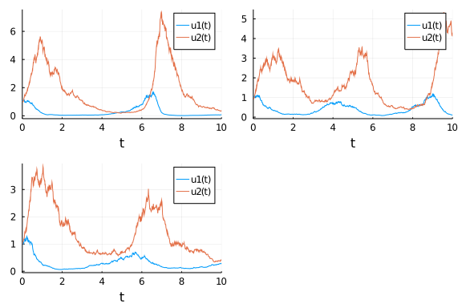

Most of the scientific community deals with the basic problem of trying to mathematically model the reality around them and this often involves dynamical systems. The general trend to model these complex dynamical systems is through the use of differential equations. Differential equation models often have non-measurable parameters. The popular “forward-problem” of simulation consists of solving the differential equations for a given set of parameters, the “inverse problem” to simulation, known as parameter estimation, is the process of utilizing data to determine these model parameters. Bayesian inference provides a robust approach to parameter estimation with quantified uncertainty.


```julia
using Turing, Distributions, DataFrames, DifferentialEquations, DiffEqSensitivity

# Import MCMCChain, Plots, and StatsPlots for visualizations and diagnostics.
using MCMCChains, Plots, StatsPlots

# Set a seed for reproducibility.
using Random
Random.seed!(12);
```


## The Lotka-Volterra Model

The Lotka–Volterra equations, also known as the predator–prey equations, are a pair of first-order nonlinear differential equations, frequently used to describe the dynamics of biological systems in which two species interact, one as a predator and the other as prey. The populations change through time according to the pair of equations:

$$\frac{dx}{dt} = (\alpha - \beta y)x$$
 
$$\frac{dy}{dt} = (\delta x - \gamma)y$$

```julia
function lotka_volterra(du,u,p,t)
  x, y = u
  α, β, δ, γ = p
  du[1] = dx = (α - β*y)x
  du[2] = dy = (δ*x - γ)y
end
p = [1.5, 1.0, 3.0, 1.0]
u0 = [1.0,1.0]
prob = ODEProblem(lotka_volterra,u0,(0.0,10.0),p)
sol = solve(prob,Tsit5())
plot(sol)
```


We'll generate the data to use for the parameter estimation from simulation. 
With the `saveat` [argument](https://docs.sciml.ai/latest/basics/common_solver_opts/) we specify that the solution is stored only at `0.1` time units. 

```julia
odedata = Array(solve(prob,Tsit5(),saveat=0.1))
```

```
2×101 Array{Float64,2}:
 1.0  1.03981  1.05332  1.03247  0.972908  …  0.133965  0.148601  0.165247
 1.0  1.22939  1.52387  1.88714  2.30908      0.476902  0.450153  0.426924
```


## Fitting Lotka-Volterra with DiffEqBayes

[DiffEqBayes.jl](https://github.com/SciML/DiffEqBayes.jl) is a high level package that set of extension functionality for estimating the parameters of differential equations using Bayesian methods. It allows the choice of using CmdStan.jl, Turing.jl, DynamicHMC.jl and ApproxBayes.jl to perform a Bayesian estimation of a differential equation problem specified via the DifferentialEquations.jl interface. You can read the [docs](https://docs.sciml.ai/latest/analysis/parameter_estimation/#Bayesian-Methods-1) for an understanding of the available functionality.


```julia
using DiffEqBayes
t = 0:0.1:10.0
priors = [truncated(Normal(1.5,0.5),0.5,2.5),truncated(Normal(1.2,0.5),0,2),truncated(Normal(3.0,0.5),1,4),truncated(Normal(1.0,0.5),0,2)]
bayesian_result_turing = turing_inference(prob,Tsit5(),t,odedata,priors,num_samples=10_000)
```

```
Chains MCMC chain (10000×17×1 Array{Float64,3}):

Iterations        = 1:10000
Thinning interval = 1
Chains            = 1
Samples per chain = 10000
parameters        = theta[1], theta[2], theta[3], theta[4], σ[1]
internals         = acceptance_rate, hamiltonian_energy, hamiltonian_energy
_error, is_accept, log_density, lp, max_hamiltonian_energy_error, n_steps, 
nom_step_size, numerical_error, step_size, tree_depth

Summary Statistics
  parameters      mean       std   naive_se      mcse         ess      rhat
      Symbol   Float64   Float64    Float64   Float64     Float64   Float64

    theta[1]    1.5004    0.0061     0.0001    0.0001   3404.6598    0.9999
    theta[2]    1.0001    0.0038     0.0000    0.0001   3474.0288    1.0000
    theta[3]    2.9990    0.0046     0.0000    0.0001   4724.4381    1.0006
    theta[4]    0.9997    0.0033     0.0000    0.0001   3368.4415    0.9999
        σ[1]    0.0151    0.0011     0.0000    0.0000   5444.8229    1.0000

Quantiles
  parameters      2.5%     25.0%     50.0%     75.0%     97.5%
      Symbol   Float64   Float64   Float64   Float64   Float64

    theta[1]    1.4882    1.4964    1.5003    1.5045    1.5120
    theta[2]    0.9926    0.9976    1.0001    1.0027    1.0074
    theta[3]    2.9899    2.9960    2.9991    3.0021    3.0081
    theta[4]    0.9934    0.9975    0.9997    1.0019    1.0064
        σ[1]    0.0132    0.0144    0.0151    0.0158    0.0173
```


The estimated parameters are clearly very close to the desired parameter values. We can also check that the chains have converged in the plot.

```julia
plot(bayesian_result_turing)
```


## Direct Handling of Bayesian Estimation with Turing

You could want to do some sort of reduction with the differential equation's solution or use it in some other way as well. In those cases DiffEqBayes might not be useful. Turing and DifferentialEquations are completely composable and you can write of the differential equation inside a Turing `@model` and it will just work.

We can rewrite the Lotka Volterra parameter estimation problem with a Turing `@model` interface as below

```julia
Turing.setadbackend(:forwarddiff)

@model function fitlv(data)
    σ ~ InverseGamma(2, 3)
    α ~ truncated(Normal(1.5,0.5),0.5,2.5)
    β ~ truncated(Normal(1.2,0.5),0,2)
    γ ~ truncated(Normal(3.0,0.5),1,4)
    δ ~ truncated(Normal(1.0,0.5),0,2)

    p = [α,β,γ,δ]
    prob = ODEProblem(lotka_volterra,u0,(0.0,10.0),p)
    predicted = solve(prob,Tsit5(),saveat=0.1)

    for i = 1:length(predicted)
        data[:,i] ~ MvNormal(predicted[i], σ)
    end
end

model = fitlv(odedata)
chain = sample(model, NUTS(.65),10000)
```

```
Chains MCMC chain (10000×17×1 Array{Float64,3}):

Iterations        = 1:10000
Thinning interval = 1
Chains            = 1
Samples per chain = 10000
parameters        = α, β, γ, δ, σ
internals         = acceptance_rate, hamiltonian_energy, hamiltonian_energy
_error, is_accept, log_density, lp, max_hamiltonian_energy_error, n_steps, 
nom_step_size, numerical_error, step_size, tree_depth

Summary Statistics
  parameters      mean       std   naive_se      mcse         ess      rhat
      Symbol   Float64   Float64    Float64   Float64     Float64   Float64

           α    0.9064    0.2690     0.0027    0.0036   5985.4811    1.0001
           β    1.8513    0.1191     0.0012    0.0018   4668.6450    1.0005
           γ    2.5921    0.3591     0.0036    0.0056   4737.9454    0.9999
           δ    0.1244    0.0238     0.0002    0.0004   4806.0365    0.9999
           σ    0.8757    0.0448     0.0004    0.0007   4648.0826    1.0000

Quantiles
  parameters      2.5%     25.0%     50.0%     75.0%     97.5%
      Symbol   Float64   Float64   Float64   Float64   Float64

           α    0.5199    0.6907    0.8690    1.0791    1.5078
           β    1.5629    1.7839    1.8787    1.9469    1.9950
           γ    1.9111    2.3527    2.5849    2.8311    3.3142
           δ    0.0810    0.1081    0.1232    0.1396    0.1742
           σ    0.7940    0.8451    0.8738    0.9041    0.9703
```


## Scaling to Large Models: Adjoint Sensitivities

DifferentialEquations.jl's efficiency for large stiff models has been shown in multiple [benchmarks](https://github.com/SciML/DiffEqBenchmarks.jl). To learn more about how to optimize solving performance for stiff problems you can take a look at the [docs](https://docs.sciml.ai/latest/tutorials/advanced_ode_example/). 

[Sensitivity analysis](https://docs.sciml.ai/latest/analysis/sensitivity/), or automatic differentiation (AD) of the solver, is provided by the DiffEq suite. The model sensitivities are the derivatives of the solution $u(t)$ with respect to the parameters. Specifically, the local sensitivity of the solution to a parameter is defined by how much the solution would change by changes in the parameter. Sensitivity analysis provides a cheap way to calculate the gradient of the solution which can be used in parameter estimation and other optimization tasks.


The AD ecosystem in Julia allows you to switch between forward mode, reverse mode, source to source and other choices of AD and have it work with any Julia code. For a user to make use of this within [SciML](https://sciml.ai), [high level interactions in `solve`](https://docs.sciml.ai/latest/analysis/sensitivity/#High-Level-Interface:-sensealg-1) automatically plug into those AD systems to allow for choosing advanced sensitivity analysis (derivative calculation) [methods](https://docs.sciml.ai/latest/analysis/sensitivity/#Sensitivity-Algorithms-1). 

More theoretical details on these methods can be found at: https://docs.sciml.ai/latest/extras/sensitivity_math/.

While these sensitivity analysis methods may seem complicated (and they are!), using them is dead simple. Here is a version of the Lotka-Volterra model with adjoints enabled.

All we had to do is switch the AD backend to one of the adjoint-compatible backends (ReverseDiff, Tracker, or Zygote) and boom the system takes over and we're using adjoint methods! Notice that on this model adjoints are slower. This is because adjoints have a higher overhead on small parameter models and we suggest only using these methods for models with around 100 parameters or more. For more details, see https://arxiv.org/abs/1812.01892.


```julia
using Zygote
Turing.setadbackend(:zygote)

@model function fitlv(data)
    σ ~ InverseGamma(2, 3)
    α ~ truncated(Normal(1.5,0.5),0.5,2.5)
    β ~ truncated(Normal(1.2,0.5),0,2)
    γ ~ truncated(Normal(3.0,0.5),1,4)
    δ ~ truncated(Normal(1.0,0.5),0,2)
    p = [α,β,γ,δ]
    prob = ODEProblem(lotka_volterra,u0,(0.0,10.0),p)
    predicted = solve(prob,saveat=0.1)
    for i = 1:length(predicted)
        data[:,i] ~ MvNormal(predicted[i], σ)
    end
end;
model = fitlv(odedata)
chain = sample(model, NUTS(.65),1000)
```


Now we can exercise control of the sensitivity analysis method that is used by using the `sensealg` keyword argument. Let's choose the `InterpolatingAdjoint` from the available AD [methods](https://docs.sciml.ai/latest/analysis/sensitivity/#Sensitivity-Algorithms-1) and enable a compiled ReverseDiff vector-Jacobian product:

```julia
@model function fitlv(data)
    σ ~ InverseGamma(2, 3)
    α ~ truncated(Normal(1.5,0.5),0.5,2.5)
    β ~ truncated(Normal(1.2,0.5),0,2)
    γ ~ truncated(Normal(3.0,0.5),1,4)
    δ ~ truncated(Normal(1.0,0.5),0,2)
    p = [α,β,γ,δ]
    prob = ODEProblem(lotka_volterra,u0,(0.0,10.0),p)
    predicted = solve(prob,saveat=0.1,sensealg=InterpolatingAdjoint(autojacvec=ReverseDiffVJP(true)))
    for i = 1:length(predicted)
        data[:,i] ~ MvNormal(predicted[i], σ)
    end
end;
model = fitlv(odedata)
@time chain = sample(model, NUTS(.65),1000)
```

```
78.460493 seconds (480.65 M allocations: 23.356 GiB, 6.11% gc time)
Chains MCMC chain (1000×17×1 Array{Float64,3}):

Iterations        = 1:1000
Thinning interval = 1
Chains            = 1
Samples per chain = 1000
parameters        = α, β, γ, δ, σ
internals         = acceptance_rate, hamiltonian_energy, hamiltonian_energy
_error, is_accept, log_density, lp, max_hamiltonian_energy_error, n_steps, 
nom_step_size, numerical_error, step_size, tree_depth

Summary Statistics
  parameters      mean       std   naive_se      mcse        ess      rhat
      Symbol   Float64   Float64    Float64   Float64    Float64   Float64

           α    1.5001    0.0062     0.0002    0.0003   424.7211    1.0000
           β    1.0001    0.0038     0.0001    0.0002   434.1048    0.9995
           γ    2.9992    0.0047     0.0001    0.0002   632.5301    1.0019
           δ    0.9999    0.0034     0.0001    0.0002   420.5182    1.0000
           σ    0.0152    0.0011     0.0000    0.0001   474.2303    1.0019

Quantiles
  parameters      2.5%     25.0%     50.0%     75.0%     97.5%
      Symbol   Float64   Float64   Float64   Float64   Float64

           α    1.4888    1.4961    1.5000    1.5041    1.5125
           β    0.9929    0.9974    1.0000    1.0025    1.0073
           γ    2.9897    2.9960    2.9994    3.0022    3.0085
           δ    0.9932    0.9976    0.9999    1.0021    1.0060
           σ    0.0130    0.0144    0.0152    0.0159    0.0174
```


For more examples of adjoint usage on large parameter models, consult the [DiffEqFlux documentation](https://diffeqflux.sciml.ai/dev/)

## Including Process Noise: Estimation of Stochastic Differential Equations

This can be easily extended to Stochastic Differential Equations as well.

Let's create the Lotka Volterra equation with some noise and try out estimating it with the same framework we have set up before.

Our equations now become:

$$dx = (\alpha - \beta y)xdt + \phi_1 xdW_1$$

$$dy = (\delta x - \gamma)ydt + \phi_2 ydW_2$$

```julia
function lotka_volterra_noise(du,u,p,t)
    du[1] = p[5]*u[1]
    du[2] = p[6]*u[2]
end
p = [1.5, 1.0, 3.0, 1.0, 0.3, 0.3]
prob = SDEProblem(lotka_volterra,lotka_volterra_noise,u0,(0.0,10.0),p)
```

```
SDEProblem with uType Array{Float64,1} and tType Float64. In-place: true
timespan: (0.0, 10.0)
u0: [1.0, 1.0]
```


Solving it repeatedly confirms the randomness of the solution

```julia
sol = solve(prob,saveat=0.01)
p1 = plot(sol)
sol = solve(prob,saveat=0.01)
p2 = plot(sol)
sol = solve(prob,saveat=0.01)
p3 = plot(sol)
plot(p1,p2,p3)
```




With the `MonteCarloSummary` it is easy to summarize the results from multiple runs through the `EnsembleProblem` interface, here we run the problem for 1000 `trajectories` and visualize the summary:

```julia
sol = solve(EnsembleProblem(prob),SRIW1(),saveat=0.1,trajectories=500)
summ = MonteCarloSummary(sol)
plot(summ)
```

```
Error: UndefVarError: MonteCarloSummary not defined
```


Get data from the means to fit:

```julia
using DiffEqBase.EnsembleAnalysis
averagedata = Array(timeseries_steps_mean(sol))
```

```
2×101 Array{Float64,2}:
 1.0  1.04163  1.05619  1.03815  0.978093  …  0.180219  0.185335  0.192644
 1.0  1.22557  1.51912  1.87846  2.30828      1.18185   1.13772   1.09994
```


Now fit the means with Turing.

We will utilize multithreading with the [`EnsembleProblem`](https://docs.sciml.ai/stable/tutorials/sde_example/#Ensemble-Simulations-1) interface to speed up the SDE parameter estimation.

```julia
Threads.nthreads()
```

```
6
```


```julia
Turing.setadbackend(:forwarddiff)

@model function fitlv(data)
    σ ~ InverseGamma(2, 3)
    α ~ truncated(Normal(1.5,0.5),0.5,2.5)
    β ~ truncated(Normal(1.2,0.5),0,2)
    γ ~ truncated(Normal(3.0,0.5),1,4)
    δ ~ truncated(Normal(1.0,0.5),0,2)
    ϕ1 ~ truncated(Normal(1.2,0.5),0.1,1)
    ϕ2 ~ truncated(Normal(1.2,0.5),0.1,1)

    p = [α,β,γ,δ,ϕ1,ϕ2]
    prob = SDEProblem(lotka_volterra,lotka_volterra_noise,u0,(0.0,10.0),p)
    ensemble_predicted = solve(EnsembleProblem(prob),SRIW1(),saveat=0.1,trajectories=500)
    predicted_means = timeseries_steps_mean(ensemble_predicted)

    for i = 1:length(predicted_means)
        data[:,i] ~ MvNormal(predicted_means[i], σ)
    end
end;

model = fitlv(averagedata)
chain = sample(model, NUTS(.65),500)
```

```
Error: BoundsError: attempt to access 38-element Array{Array{ForwardDiff.Du
al{ForwardDiff.Tag{Turing.Core.var"#f#1"{DynamicPPL.VarInfo{NamedTuple{(:σ,
 :α, :β, :γ, :δ, :ϕ1, :ϕ2),Tuple{DynamicPPL.Metadata{Dict{DynamicPPL.VarNam
e{:σ,Tuple{}},Int64},Array{Distributions.InverseGamma{Float64},1},Array{Dyn
amicPPL.VarName{:σ,Tuple{}},1},Array{Float64,1},Array{Set{DynamicPPL.Select
or},1}},DynamicPPL.Metadata{Dict{DynamicPPL.VarName{:α,Tuple{}},Int64},Arra
y{Distributions.Truncated{Distributions.Normal{Float64},Distributions.Conti
nuous,Float64},1},Array{DynamicPPL.VarName{:α,Tuple{}},1},Array{Float64,1},
Array{Set{DynamicPPL.Selector},1}},DynamicPPL.Metadata{Dict{DynamicPPL.VarN
ame{:β,Tuple{}},Int64},Array{Distributions.Truncated{Distributions.Normal{F
loat64},Distributions.Continuous,Float64},1},Array{DynamicPPL.VarName{:β,Tu
ple{}},1},Array{Float64,1},Array{Set{DynamicPPL.Selector},1}},DynamicPPL.Me
tadata{Dict{DynamicPPL.VarName{:γ,Tuple{}},Int64},Array{Distributions.Trunc
ated{Distributions.Normal{Float64},Distributions.Continuous,Float64},1},Arr
ay{DynamicPPL.VarName{:γ,Tuple{}},1},Array{Float64,1},Array{Set{DynamicPPL.
Selector},1}},DynamicPPL.Metadata{Dict{DynamicPPL.VarName{:δ,Tuple{}},Int64
},Array{Distributions.Truncated{Distributions.Normal{Float64},Distributions
.Continuous,Float64},1},Array{DynamicPPL.VarName{:δ,Tuple{}},1},Array{Float
64,1},Array{Set{DynamicPPL.Selector},1}},DynamicPPL.Metadata{Dict{DynamicPP
L.VarName{:ϕ1,Tuple{}},Int64},Array{Distributions.Truncated{Distributions.N
ormal{Float64},Distributions.Continuous,Float64},1},Array{DynamicPPL.VarNam
e{:ϕ1,Tuple{}},1},Array{Float64,1},Array{Set{DynamicPPL.Selector},1}},Dynam
icPPL.Metadata{Dict{DynamicPPL.VarName{:ϕ2,Tuple{}},Int64},Array{Distributi
ons.Truncated{Distributions.Normal{Float64},Distributions.Continuous,Float6
4},1},Array{DynamicPPL.VarName{:ϕ2,Tuple{}},1},Array{Float64,1},Array{Set{D
ynamicPPL.Selector},1}}}},Float64},DynamicPPL.Model{Main.##WeaveSandBox#253
.var"#5#6",(:data,),(),(),Tuple{Array{Float64,2}},Tuple{}},DynamicPPL.Sampl
er{Turing.Inference.NUTS{Turing.Core.ForwardDiffAD{40},(),AdvancedHMC.DiagE
uclideanMetric}},DynamicPPL.DefaultContext},Float64},Float64,7},1},1} at in
dex [39]
```


## Appendix
 This tutorial is part of the TuringTutorials repository, found at: <https://github.com/TuringLang/TuringTutorials>.

To locally run this tutorial, do the following commands:
```julia, eval = false
using TuringTutorials
TuringTutorials.weave_file("10-bayesian-differential-equations", "10_bayesian-differential-equations.jmd")
```

Computer Information:
```
Julia Version 1.5.3
Commit 788b2c77c1 (2020-11-09 13:37 UTC)
Platform Info:
  OS: Linux (x86_64-pc-linux-gnu)
  CPU: Intel(R) Core(TM) i7-10710U CPU @ 1.10GHz
  WORD_SIZE: 64
  LIBM: libopenlibm
  LLVM: libLLVM-9.0.1 (ORCJIT, skylake)
Environment:
  JULIA_NUM_THREADS = 6

```

Package Information:

```
Status `~/Projects/public/TuringTutorials/tutorials/10-bayesian-differential-equations/Project.toml`
  [a93c6f00] DataFrames v0.22.5
  [2b5f629d] DiffEqBase v6.57.7
  [ebbdde9d] DiffEqBayes v2.23.0
  [41bf760c] DiffEqSensitivity v6.42.0
  [0c46a032] DifferentialEquations v6.16.0
  [31c24e10] Distributions v0.23.12
  [c7f686f2] MCMCChains v4.7.0
  [91a5bcdd] Plots v1.10.6
  [f3b207a7] StatsPlots v0.14.19
  [fce5fe82] Turing v0.15.11
  [9a3f8284] Random

```
